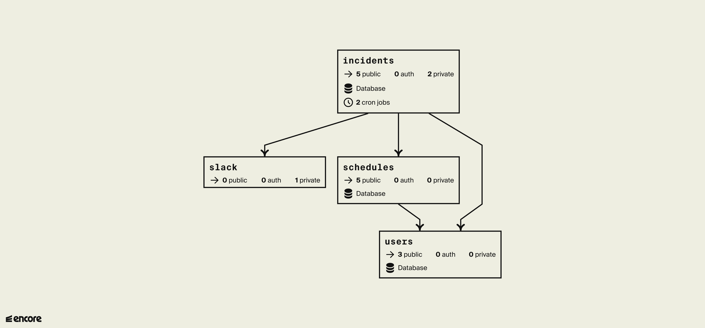

# On-call Example App

This is a Go application that allows you to easily deploy your own on-call management system:
- Create users in the system, with their names and Slack handles
- Create schedules for your on-call rotation
- An endpoint for sending alerts to, and having them either unassigned or auto-assigned to the user on-call
- Sending an alert over Slack, and every 10 minutes, until it has been acknowledged

This took about 8 hours to build from scratch, including tests using [Encore](https://encore.dev). It took 2 minutes to deploy, including with the database.
This included time to refactor for extensibility so it can support other use cases (i.e. a support ticket system).

## Install

You will need the [Encore Framework](https://encore.dev/docs/install) as well as an [Encore account (it is free!)](https://encore.dev/login) to run and deploy this application.

## Architecture



## Using the API

```bash
# Create a User and copy the User ID to your clipboard
curl -d '{
  "FirstName":"Bilawal",
  "LastName":"Hameed",
  "SlackHandle":"bil"
}' http://localhost:4000/users | jq -r '.Id' | pbcopy

# Store that User ID
export ENCORE_ONCALL_USERID=$(pbpaste)

# Create a schedule for the user we just created
curl -d '{
  "Start":"2022-09-28T10:00:00Z",
  "End":"2022-09-29T10:00:00Z"
}' "http://localhost:4000/users/$(ENCORE_ONCALL_USERID)/schedules"

# Create an incident and copy the Incident ID to your clipboard
curl -d '{
  "Body":"An unexpected error happened on example-website.com on line 38. It needs addressing now!"
}' http://localhost:4000/incidents | jq -r '.Id' | pbcopy

# Store that Incident Id
export ENCORE_ONCALL_INCIDENTID=$(pbpaste)

# Acknowledge the Incident
curl -X PUT "http://localhost:4000/incidents/$(ENCORE_ONCALL_INCIDENTID)/acknowledge"
```

## API Endpoints

Our system has concepts such as Users, Schedules, and Incidents.

### Users

Create a user:

```curl
curl -d '{
  "FirstName":"Bilawal",
  "LastName":"Hameed",
  "SlackHandle":"bil"
}' http://localhost:4000/users | jq
```

Get a user:

```curl
curl http://localhost:4000/users/1 | jq
```

List all users:

```curl
curl http://localhost:4000/users | jq '.Items'
```

### Schedules

For an existing user, add a scheduled on-call rotation:

```curl
curl -d '{
  "Start":"2022-09-28T10:00:00Z",
  "End":"2022-09-29T10:00:00Z"
}' http://localhost:4000/users/1/schedules | jq
```

List on-call schedules by time range:

```curl
curl 'http://localhost:4000/schedules?start=2022-01-01T00%3A00%3A00Z&end=2022-12-31T23%3A59%3A00Z' | jq '.Items'
```

Get the on-call schedule for a given timestamp:

```curl
curl 'http://localhost:4000/scheduled/2022-09-28T12:27:22+01:00' | jq
```

Get the on-call schedule currently active:

```curl
curl 'http://localhost:4000/scheduled' | jq
```

Delete on-call schedule by time range:

```curl
curl -X DELETE 'http://localhost:4000/schedules?start=2022-01-01T00%3A00%3A00Z&end=2022-12-31T23%3A59%3A00Z' | jq
```

### Incidents

Create a new incident:

```curl
curl -d '{
  "Body":"An unexpected error happened on example-website.com on line 38. It needs addressing now!"
}' http://localhost:4000/incidents | jq
```

Acknowledge an incident:

```curl
curl -X PUT http://localhost:4000/incidents/1/acknowledge | jq
```

Acknowledge all open incidents:

```curl
curl -X POST http://localhost:4000/incidents/acknowledge_all | jq '.Items'
```

Assign an unassigned incident to a user:

```curl
curl -X PUT -d '{
  "UserId":2
}' http://localhost:4000/incidents/1/assign | jq
```

List all open incidents:

```curl
curl http://localhost:4000/incidents | jq '.Items'
```

## Install

```bash
brew install go@1.19.1
brew install encoredev/tap/encore
git clone git@github.com:encoredev/example-app-oncall.git
encore auth signup # or encore auth login (if you already have an account)
encore run
```

## Deployment

```bash
encore app create my-oncall-app-name
git push origin main
```

Then head over to <https://app.encore.dev> to find out your production URL, and off you go into the clouds!

## Testing

```bash
encore test ./...
encore test ./... -count=1 # if you want to skip caching
```

## Contributing

All contributions are welcome! All we ask is that you adhere to the [Code of Conduct](https://github.com/encoredev/encore/blob/main/CODE_OF_CONDUCT.md)

- [Quick Start with Encore](https://encore.dev/docs/quick-start)
- [Create an Account with Encore](https://encore.dev/login)
- [Go Cheatsheet](https://encore.dev/guide/go.mod)